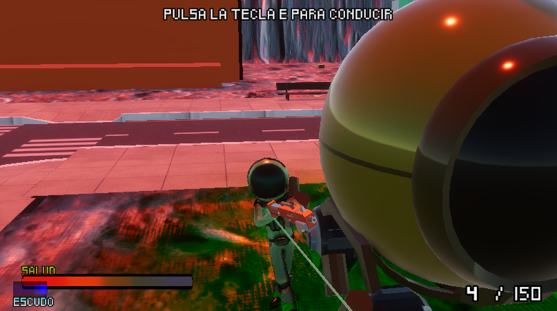
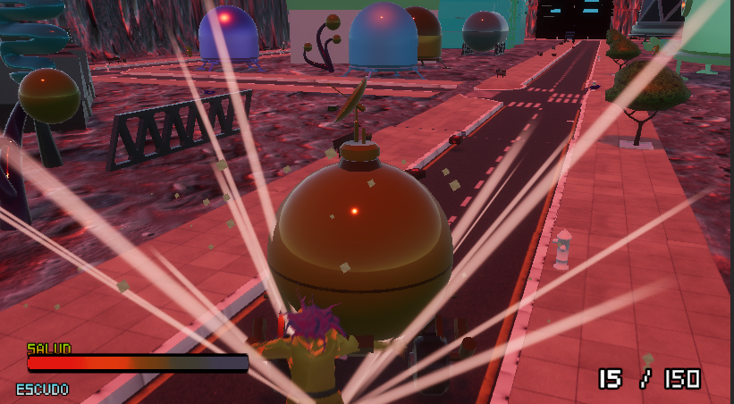
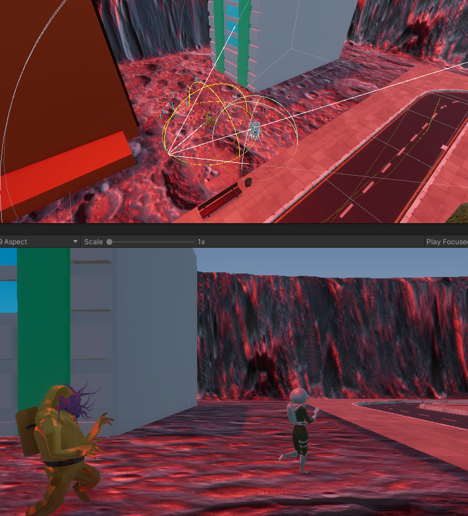
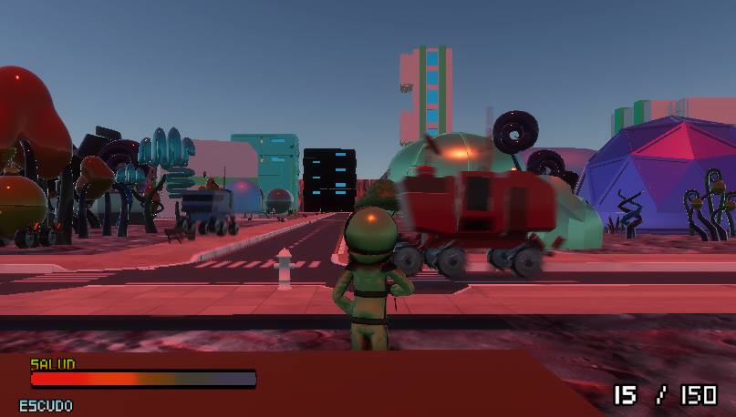

# Programación de Juegos 3D - PEC FINAL 

## ¿Cómo usar?

Abrir el projecto dentro del directorio PECFinal-MoonZombHeist, utilizando Unity 2021.3.19f.

Controles por defecto:
 - Jugador 1: 
    - Peaton
        - Movimiento: Teclas WASD
        - Correr: Sostener Shift mientras se mueve
        - Saltar: Barra Espaciadora
        - Disparar: Click Izquierdo
        - Mover Camara: Movimiento del Mouse
        - Recargar: Tecla R
        - Cambiar arma: Shift
        - Conducir Vehiculo: Tecla E
    - Vehiculo
        - Acelerar: Tecla W
        - Frenar: Tecla S
        - Direccion: Teclas A y D
        - Freno de Mano: Barra Espaciadora
        - Bajarse del Vehiculo: Tecla Q

## Estructura Lógica del Proyecto

### Gestion de Partida

Se definen una serie de Clases para repartir las responsabilidades dentro del flujo de juego, comportamiento del jugador, vehiculos, armas, enemigos, comportamientos y objetos.

- **GameManager**: El GameManager será el responsable de asistir a contener datos del jugador, particularmente para el caso del inventario y los puntos de respawn (para este caso solo se ha definido el punto inicial del nivel como parte del respawn) 

- **PlayerHelper**: Singleton para manejar referencias de Jugador y Vehiculo, PlayerInputs usando el New InputSystem de Unity, asi como los objetivos de seguimiento para Cinemachine. El proposito de esta clase es la de poder asistir a otras a la hora de cambiar las referencias de seguimiento de cámara y de controles disponibles para el jugador cuando sea peatón o esté conduciendo.

- **PlayerShooter**: Este script será la referencia del jugador de control en tercera persona y que tendrá incorporado el ThirdPersonController de los Standard Assets , así como sus información dentro de la partida (Salud, Escudo, Inventario) y adjuntas, las armas que puede utilizar con su respectivo cargador y munición, además de los clips de audio para diferentes eventos dentro del juego. Dentro del PlayerShooter se definen los comportamientos que el jugador puede realizar dentro del juego (Moverse, Disparar, Saltar, Correr, Recargar, Cambiar arma, Montarse a un vehiculo) basado en los inputs básicos de teclado mencionados anteriormente. 
El Player Shooter tambien tiene la logica que procesa cuando esta siendo atacado por enemigos y cómo se reduce su vida y escudo al recibir daños, resaltando que el escudo no protege completamente del daño recibido, haciendo que igual se baje la vida en un porcentaje menor que si no tuviera el escudo. 
En este script tambien se tendrá en cuenta el componente Animator asociado con el modelo del Jugador, con lo cual en cada una de las acciones que pueda realizar, reproducirá las animaciones segun corresponda, incluyendo (además de las acciones mencionadas anteriormente), las animaciones de reposo, recibir daños y morir. 
Finalmente, para hacer que el HUD sea reactivo a los cambios que sufren los valores del jugador, se definen una serie de Actions a los que el UIHandler estará suscrito para detectar cambios, de tal manera que cada que cambian datos de Salud, Escudo, Munición u objetos encontrados, estas acciones serán invocadas para notificar estos cambios. 

- **Weapon**: La definición extensible para cualquier arma, con su metodo Shoot que usará el raycast para efectuar disparos y producir daños a los enemigos, siempre y cuando el arma tenga el suficiente alcance para llegar a estos. Para producir comportamientos que distingan un arma de otra, se definieron elementos como capacidad del cargador, munición inicial, munición máxima, tiempo de recarga, daño, cadencia de fuego y si el arma es automática o no. Al Script de weapon tambien se le añaden un sistema de partículas y una luz de tipo Point, con el fin de simular efectos visuales de los disparos, así como efectos de sonido para darle al jugador mayor retroalimentación. 

- **EnemyAI**: Define el comportamiento de la inteligencia artificial de los enemigos. A diferencia del script original, este hace uso de los Delegates de C#, con lo cual cada una de las fases del comportamiento del enemigo (Deambular, Seguimiento, Ataque y Muerte) son definidas dentro de corrutinas que irán cambiando segán corresponda cada escenario. Este script se complementa fuertemente con el NavMeshAgent, usando el método SamplePosition para que el enemigo se vaya moviendo de manera aleatoria por el terreno válido del navmesh. Haciendo uso del Overlapping Sphere en lugar de un Collider en Trigger, el enemigo puede determinar su objetivo a atacar, entre NPCs y el jugador (dándole mayor prioridad siempre al jugador si está en su rango de visión dado por el radio de la esfera de sobrelapamiento), posterior a esto pasa de un estado de deambulante a seguimiento y cuando el objetivo está dentro de su rango de ataque, empezará a efectuarle daño mientras esta condición se cumpla. Adicionalmente, se le da un comportamiento para recibir daño de parte del jugador tanto como Hit de disparos como cuando colisiona contra un carro.

- **NPCAI**: Define el comportamiento de la inteligencia artificial de los NPCs que andaran por un circuito definido de WayPoints a través del uso de NavMesh. Similar al anterior script, este tambien tiene un conjunto de estados definidos que irá cambiando según se den las circunstancias: Patrulla por los waypoints; Huida, cuando un enemigo entra en su rango de visión (este si con un Sphere Collider en modo Trigger) y moviendose en la dirección opuesta al enemigo; Atacado y Muerto, en los cuales ya ha detectado que esta siendo irremediablemente atacado por el enemigo y ya solo le queda ser mordido por este hasta que se agote su vida y "transformarse". 
Para el flujo de transformación, se instancia un prefab de zombie nuevo con su EnemyAI asociado, en lo que se destruye esta instancia de NPC. Tambien cabe señalar que el NPC puede eliminarse al ser golpeado por un vehiculo al igual que los zombies. 

- **EnemyDropper**: Al asociarlo a objetos que son destruibles, como los enemigos, se le añade la referencia a cualquier prefab que implemente el script Consumible. Cuando se activa el OnDestroy, se va a spawnear un objeto consumible con un valor determinado. Esto incluye tambien llaves para desbloquear puertas.

- **CarManager**: Los Vehículos en escena se apoyan en versiones modificadas de los CarController, CarAIController, WaypointProgressTracker,  CarAudio y CarUserController para que puedan ser utilizados en la versión 2021.3.19f junto con el New Input System de Unity. Este Script se encarga de manejar dinámicamente el habilitar o deshabilitar todos estos otros componentes asociados y poder hacer un cambio entre el poder controlar al jugador en tercera persona o un vehiculo en particular. 
Cuando el jugador se encuentra en cercanias del vehiculo, se le notificará tanto en UI como con un efecto en el suelo que puede montarse en este. Al hacerlo, la referencia del PlayerShooter queda como hija del Vehiculo pero se desactiva (de tal manera que "viaja" con el vehiculo), se deshabilitan sus inputs y se activan los del vehiculo, asi como cambiar el objetivo de seguimiento de la Cinemachine al vehiculo. Cuando el jugador se baja del vehiculo, el PlayerShooter deja de ser hijo del vehiculo, se activa en escena nuevamente, se desactivan los inputs del vehiculo, se activan los del PlayerShooter, y la cinemachine vuelve a hacer seguimiento del jugador.

- **CarAIController**: Esto viene de una adaptación de los antiguos Standard Assets de Unity para controles de Vehiculos. Definiendo un circuito cerrado de waypoints, mientras el objeto tenga un CarController asociado y configurado correctamente, los vehiculos pueden hacer un seguimiento autónomo de dicho circuito.

- **UIHelper**:  Como se menciona en el PlayerShooter, el UIHelper va a tener las referencias a los objetos del Canvas que compongan el HUD del jugador, con el fin de poder otorgarle al mismo la información correcta y actualizada de su estado actual en terminos de Salud, Escudo, Cargador, Munición y objetos adquiridos. Por cada uno de los Actions definidos en el PlayerShooter, habrá un metodo void que reaccionará a los cambios de los valores a los que esté suscrito.

- **Consumable** : Define todos los objetos que pueden ser consumidos por el jugador, clasificados a través del enum ConsumableType, que contiene los tipos HEALTH, AMMO, SHIELD, KEY. El objeto que implemente este script debe de tener un collider en trigger para funcionar, ya que al entrar en contacto con el jugador, este aplicara los cambios segun corresponda (otorgandole mas vida, escudo, munición o llaves) para luego desaparecer al ser consumido. Los objetos Consumable también pueden ser "droppeados" por los enemigos al ser derrotados.

- **AimHelper**: Para asistir a los jugadores, se añade este Script el cual gira al personaje jugable para que apunte siempre al enemigo más cercano dentro del rango de fuego del arma que tenga seleccionada. Junto con este, se tiene un gameObject que servirá de mira láser para que quede claro que los disparos siempre se efectuan en la dirección en la que mira el jugador.

- **ZombieSpawner**: Con este Script, se define un prefab para spawnear con una frecuencia inicial en segundos. Adicionalmente, se le define una taza porcentual de reducción, con el fin que a medida que pasa el tiempo, cada spawn ocurre más rápido que el anterior, con lo cual habrán áreas que empezarán a llenarse de zombies más y más rapido. Se le pone un mínimo, dado que la reducción puede llegar a un punto en que la frecuencia sea tan baja que sea inmanejable seguir spawneando más enemigos.

## Video de Demostración

[Video de YouTube aquí <----](https://youtu.be/jVad5kZBtoA)

## Estructura de Escenas

1. Pantalla Principal 
2. Mapa Marciano
4. Preferencias
3. Créditos

## Créditos

Banda Sonora
- Dam - GoldenEye 007 N64 - Remix Megadrive SoundFont

Assets Importados
- Assets_Crate_Barrels
- Boxes and Pallets
- Easy Primitive People
- Extrem Sci-fi LITE
- iPoly3D
- MedicalBox
- MetnalDreamAssets
- ModernWeaponsPack
- PopupAsylum
- Simple Box Pack
- Toon Gas City

Modelos 3D
 - Astronauta - Muko_Art (https://skfb.ly/oESX9)
 - Slim Astronaut - https://sketchfab.com/3d-models/astronaut-sci-fi-person-slim-0703d75f03e04798865493386a1a1f07
 - Dark Astronaut - https://sketchfab.com/3d-models/dark-astronaut-1b2d325edc814d068e920add2ecc8a32
 - WHO Zombie - https://sketchfab.com/3d-models/who-zombie-334db89498904dedb4b939f0f0f42c15 
 - Ultimate Space Kit - https://sketchfab.com/3d-models/ultimate-space-kit-84c108ff2bcf4d4cbf2adff74a942822

Efectos de Sonido
- RPG Maker VX Ace Runtime Package.
- https://kronbits.itch.io/freesfx
- GoldenEye 007 N64 - Rareware 
- Resident Evil 3: Nemesis - PS1 - Capcom

